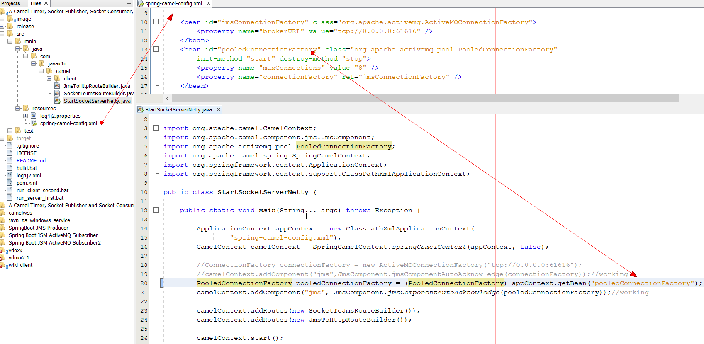
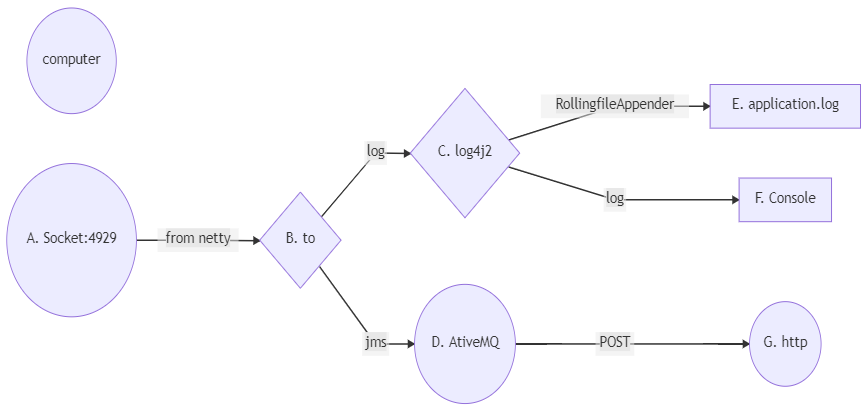

# camel-netty-socket-jms
## Execution steps
This application has two main files. One to start server and another to start client.
Server part recieves message on socket port 4209 and route (redirect) it to jms. (==Make sure you have activemq installed on your system==)

Client part generates message with help of timer component, and sends it to socket port 4209 after each 2 seconds.

If you want to compile this repository then use build.bat file otherwise you can just run it.

Step-1: Download this repository and open two command prompt.
In first command prompt start server side by running run_server_first.bat file.


Step-2: In second command prompt start client side by running run_client_second.bat file.


#### Output


### connection pool setting



## Common-Errors and FAQ

### No component found with scheme: mina
org.apache.camel.ResolveEndpointFailedException: Failed to resolve endpoint: mina://tcp://localhost:4209?sync=false due to: No component found with scheme: mina
	
	Solution:add mina dependency in classpath

### Server name and port numbers are hard coded in this project how can externalize it.
	In next project you we will look into it.
	
### You have not configured connection pool for activemq to improve performance
	In next project you we will look into it.
	
### How can i install it as service?
	open cmd and goto release folder.
	change path according to your computer
	E:\camel-socket\release>InstallAsWindowsService.bat

### Flow Diagram
[Online Editor Link used to genrate below diagram with mermaid](https://mermaid-js.github.io/mermaid-live-editor)
```
graph LR
  1[1] --> 2{2}
  2 --> 2.1[2.1]
  2 --> 2.2[2.2]

  K[socket] --> M{to}
  M --> N1[JMS]
  M --> N2[LOG]

  A[A. Socket:4929] -->|from netty| B{B. to}
  B -->|log| C{C. log4j2}
  B -->|jms| D[D. AtiveMQ]
  C -->|RollingfileAppender| E[E. application.log]
  C -->|log|F[F. Console]
```
```
graph LR
	A[jmsConnectionFactory] --> B(pooledConnectionFactory)
	B --> C1[JmsComponent]
	C1 --> D{CamelContext}
	C2[SocketToJmsRoute] --> D
	C3[JmsToHttpRoute] --> D
```
### Flow Diagram


### Object Diagram

